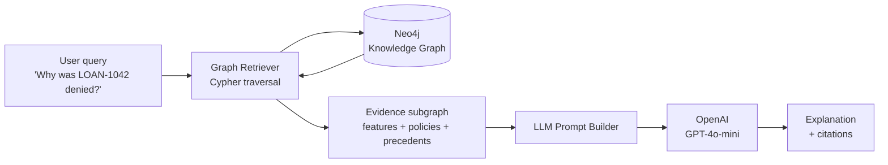

# GraphRAG Decision Trace

> **Explainable AI for financial decisions** — combine a Neo4j knowledge graph with an LLM to produce auditable, evidence-grounded explanations of loan approvals and denials.

[](https://www.python.org/)
[](https://neo4j.com/)
[](https://fastapi.tiangolo.com/)
[](LICENSE)

---

## Why this exists

Financial institutions cannot ship pure-LLM decisioning into production — regulators (CFPB, ECOA, GDPR Article 22) require **auditable reasoning** behind every adverse action. A vanilla LLM "I think this loan should be denied because the applicant looks risky" is unshippable.

**GraphRAG** fixes this. We:

1. Store decisions, applicants, features, policies, and similar past cases as a **knowledge graph** in Neo4j.
2. When asked *"why was application LOAN-1042 denied?"*, traverse the graph to retrieve only the evidence connected to that decision — features that triggered, policies that applied, similar past cases that were precedent.
3. Pass that **bounded, cited context** to an LLM, which writes a natural-language explanation grounded in the retrieved subgraph.

The result: an explanation that's both human-readable *and* traceable back to specific graph nodes — every claim has a citation.

---

## Architecture



**Graph schema**

```
(:Applicant)-[:SUBMITTED]->(:LoanApplication)-[:HAS_FEATURE]->(:Feature)
(:LoanApplication)-[:RECEIVED]->(:Decision)
(:Decision)-[:APPLIED]->(:Policy)
(:LoanApplication)-[:SIMILAR_TO {score}]->(:LoanApplication)
```

---

## Quick start

**Prereqs**: Docker, Python 3.11+, an OpenAI API key.

```bash
# 1. Set up env
cp .env.example .env
# edit .env, paste your OPENAI_API_KEY

# 2. Start Neo4j, install deps, seed the graph
make setup
make seed

# 3. Trace a decision from the CLI
make trace LOAN=LOAN-1042

# 4. Or run the API and hit it from the browser
make api
# -> open http://localhost:8000
```

---

## Example output

```text
$ make trace LOAN=LOAN-1042

Decision: DENIED
Decided: 2025-08-14

Why:
This application was denied because two policies were triggered:

  1. POL-DTI-MAX (Debt-to-income ratio above 0.43)
     - Applicant DTI: 0.51  [cited from Feature node f_LOAN-1042_dti]
  2. POL-FICO-MIN (FICO score below 620 for unsecured loans)
     - Applicant FICO: 588  [cited from Feature node f_LOAN-1042_fico]

Precedent: 3 similar past applications (by feature similarity > 0.85)
were also denied, suggesting consistent application of policy:
  - LOAN-0117 (denied, similarity 0.91)
  - LOAN-0843 (denied, similarity 0.88)
  - LOAN-0921 (denied, similarity 0.86)

All cited evidence is retrievable from the graph for audit.
```

---

## Project layout

```
graphrag_trace/
  graph.py        Neo4j connection + schema bootstrapping
  seed.py         Load sample data into the graph
  retriever.py    Cypher queries that pull the evidence subgraph
  llm.py          OpenAI prompt construction + invocation
  tracer.py       Orchestrates retrieve -> prompt -> explain
  api.py          FastAPI service + minimal HTML UI
  cli.py          `python -m graphrag_trace trace <LOAN_ID>`
data/
  loans.json      40 synthetic loan applications + features + decisions
  policies.json   8 lending policies (DTI cap, FICO floor, etc.)
tests/
  test_smoke.py   End-to-end smoke test against a live Neo4j
```

---

## What this is and isn't

**Is**: a small, focused, end-to-end working demo of the GraphRAG pattern applied to a regulated domain. Designed to be readable in one sitting and runnable in five minutes.

**Isn't**: a production system. The dataset is synthetic, the LLM prompt is deliberately minimal, and the similarity edges are precomputed rather than embedding-based. Each of those is a clear next step rather than a pretended capability.

---

## Roadmap (honest)

- [ ] Embedding-based similarity edges (replace the precomputed `SIMILAR_TO`)
- [ ] Stream LLM tokens to the UI
- [ ] Swap GPT-4o-mini for an open model via vLLM for fully on-prem deployment
- [ ] Add an evaluation harness that checks the explanation cites only retrieved evidence

---

## License

MIT — see [LICENSE](LICENSE).
